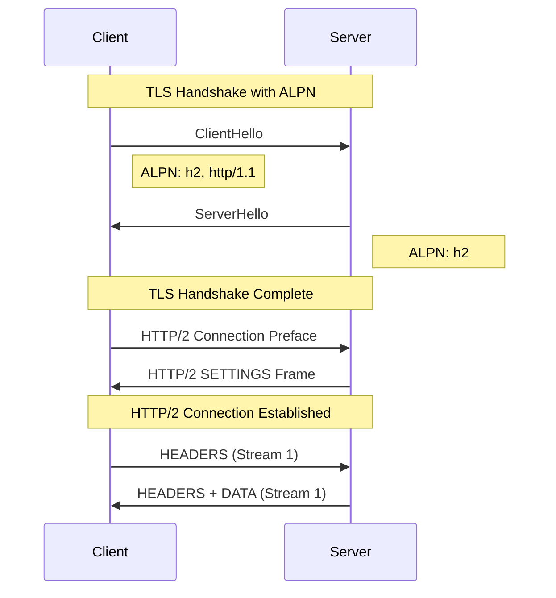
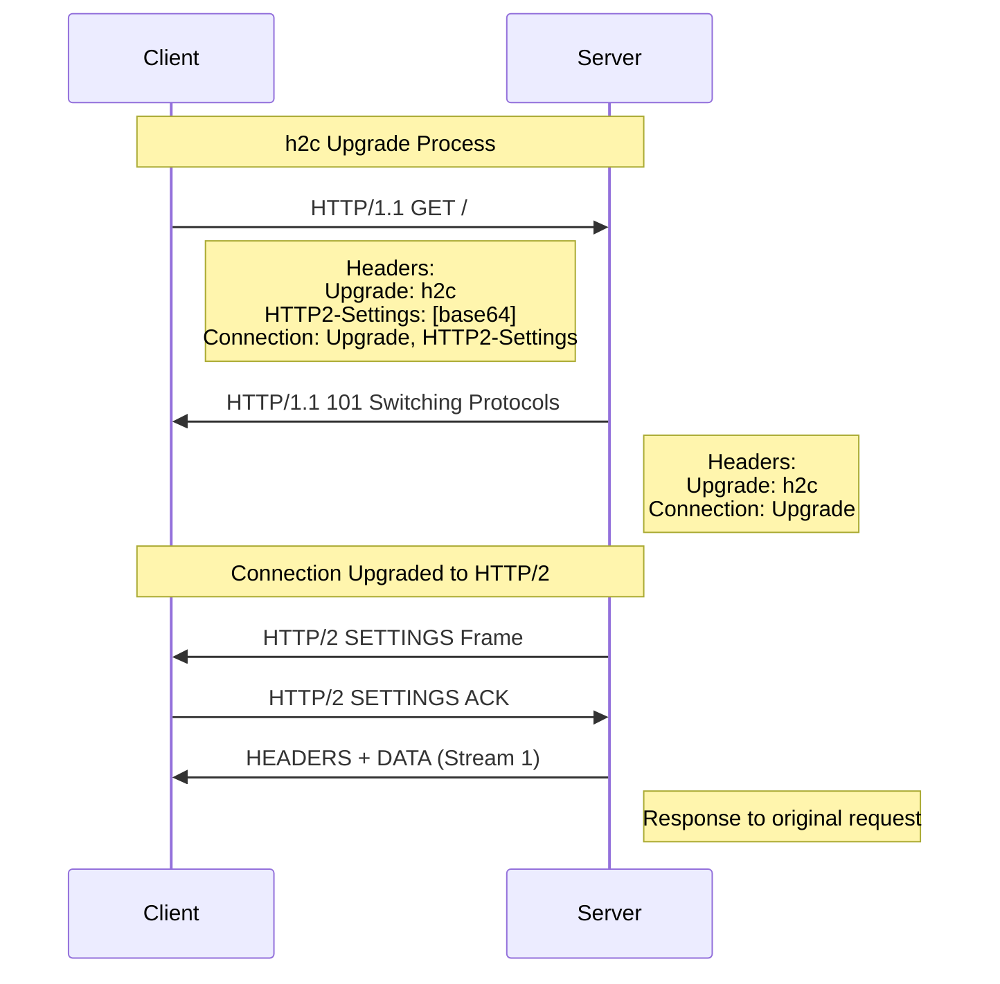
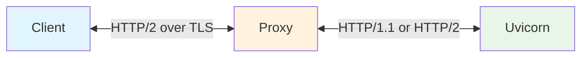

**Uvicorn** supports HTTP/2, the major revision of the HTTP protocol that provides significant
performance improvements over HTTP/1.1.

!!! warning "Experimental Feature"
    HTTP/2 support is currently **experimental** and is **not enabled by default**.

## Overview

HTTP/2 introduces several key features:

- **Multiplexing**: Multiple requests and responses can be sent simultaneously over a single TCP connection
- **Header compression**: HTTP headers are compressed using HPACK, reducing overhead
- **Binary protocol**: More efficient parsing compared to HTTP/1.1's text-based format
- **Stream prioritization**: Clients can indicate which resources are more important

## Enabling HTTP/2

To enable HTTP/2 support in Uvicorn, use the `--http2` flag:

=== "Command Line"
    ```bash
    uvicorn main:app --http2
    ```

=== "Programmatic"
    ```python
    import uvicorn

    uvicorn.run("main:app", http2=True)
    ```

!!! note
    HTTP/2 support requires the `h2` package. Install it with:
    ```bash
    pip install h2
    ```

## Connection Methods

HTTP/2 can be established through two different mechanisms: **h2** (over TLS) and **h2c** (cleartext).

### h2: HTTP/2 over TLS (Recommended)

When using HTTPS, HTTP/2 is negotiated via **ALPN** (Application-Layer Protocol Negotiation)
during the TLS handshake. This is the most common and recommended way to use HTTP/2.



**Configuration:**

=== "Command Line"
    ```bash
    uvicorn main:app --http2 --ssl-keyfile key.pem --ssl-certfile cert.pem
    ```

=== "Programmatic"
    ```python
    import uvicorn

    uvicorn.run(
        "main:app",
        http2=True,
        ssl_keyfile="key.pem",
        ssl_certfile="cert.pem",
    )
    ```

**Testing with curl:**

```bash
curl -v --http2 https://localhost:8000/
```

You should see `ALPN: server accepted h2` and `using HTTP/2` in the output.

### h2c: HTTP/2 Cleartext

HTTP/2 can also be used without TLS through an **upgrade mechanism**. The client sends an
HTTP/1.1 request with upgrade headers, and if the server supports HTTP/2, it responds with
`101 Switching Protocols`.



**Configuration:**

=== "Command Line"
    ```bash
    uvicorn main:app --http2
    ```

=== "Programmatic"
    ```python
    import uvicorn

    uvicorn.run("main:app", http2=True)
    ```

**Testing with curl:**

```bash
curl -v --http2 http://localhost:8000/
```

You should see `101 Switching Protocols` with `Upgrade: h2c`, followed by the HTTP/2 response.

!!! warning
    h2c is not supported by web browsers. Browsers only support HTTP/2 over TLS (h2).
    h2c is primarily useful for internal services, proxies, or testing.

## ASGI Scope

When a request comes in over HTTP/2, the ASGI scope will have `http_version` set to `"2"`:

```python
async def app(scope, receive, send):
    assert scope["type"] == "http"
    print(f"HTTP Version: {scope['http_version']}")  # "2" for HTTP/2
    # ... handle request
```

## Using with Reverse Proxies

In production, Uvicorn is typically deployed behind a reverse proxy like Nginx, Caddy, or HAProxy.

**Benefits of using a reverse proxy:**

- **TLS termination**: The proxy handles SSL/TLS encryption, offloading this work from your application
- **Load balancing**: Distribute requests across multiple Uvicorn instances
- **Static file serving**: Serve static assets directly without hitting your Python application
- **Request buffering**: Buffer slow clients to free up Uvicorn workers
- **Security**: Hide your application server details, add rate limiting, and filter malicious requests
- **HTTP/2 to clients**: Provide HTTP/2 benefits to clients even if using HTTP/1.1 internally



### Proxy HTTP/2 Upstream Support

**HTTP/2 Upstream** refers to the protocol used between the proxy and the backend server (Uvicorn).
While all modern proxies support HTTP/2 for client connections, support for HTTP/2 to backend
servers varies.

**Multiplexing** is HTTP/2's ability to send multiple requests simultaneously over a single TCP
connection. Without multiplexing, each request requires its own connection, negating a key
benefit of HTTP/2. Some proxies support HTTP/2 upstream but open a new connection per request,
which means they don't truly multiplex.

Here's the current state of proxy support:

| Proxy | HTTP/2 Upstream | Multiplexing | Documentation |
|-------|-----------------|--------------|---------------|
| **Envoy** | Yes | Yes | [Connection Pooling Docs](https://www.envoyproxy.io/docs/envoy/latest/intro/arch_overview/upstream/connection_pooling) |
| **Caddy** | Yes | Yes | [reverse_proxy Docs](https://caddyserver.com/docs/caddyfile/directives/reverse_proxy) |
| **HAProxy** | Yes | Yes | [HTTP Keep-Alive Blog](https://www.haproxy.com/blog/http-keep-alive-pipelining-multiplexing-and-connection-pooling) |
| **Traefik** | Yes | Yes | [ServersTransport Docs](https://doc.traefik.io/traefik/routing/services/#serverstransport) |
| **Apache** | Partial | No | [mod_proxy_http2 Docs](https://httpd.apache.org/docs/trunk/mod/mod_proxy_http2.html) |
| **Nginx** | Limited | No | [GitHub Issue #1066](https://github.com/nginx/nginx/issues/1066) |

#### Proxies with Full HTTP/2 Upstream Support

##### Envoy

Envoy fully supports HTTP/2 upstream with multiplexing. It's the preferred protocol for
microservices communication.

```yaml
# envoy.yaml
static_resources:
  listeners:
    - name: listener_0
      address:
        socket_address:
          address: 0.0.0.0
          port_value: 8443
      filter_chains:
        - filters:
            - name: envoy.filters.network.http_connection_manager
              typed_config:
                "@type": type.googleapis.com/envoy.extensions.filters.network.http_connection_manager.v3.HttpConnectionManager
                stat_prefix: ingress_http
                route_config:
                  name: local_route
                  virtual_hosts:
                    - name: local_service
                      domains: ["*"]
                      routes:
                        - match:
                            prefix: "/"
                          route:
                            cluster: uvicorn_cluster
                http_filters:
                  - name: envoy.filters.http.router
                    typed_config:
                      "@type": type.googleapis.com/envoy.extensions.filters.http.router.v3.Router
  clusters:
    - name: uvicorn_cluster
      connect_timeout: 5s
      type: STRICT_DNS
      lb_policy: ROUND_ROBIN
      http2_protocol_options: {}  # Enable HTTP/2 to upstream
      load_assignment:
        cluster_name: uvicorn_cluster
        endpoints:
          - lb_endpoints:
              - endpoint:
                  address:
                    socket_address:
                      address: 127.0.0.1
                      port_value: 8000
```

##### Caddy

Caddy defaults to HTTP/2 when proxying to upstreams. Use `h2c://` for cleartext HTTP/2.

```caddyfile
# Caddyfile
localhost {
    reverse_proxy h2c://127.0.0.1:8000
}
```

Or with explicit transport configuration:

```caddyfile
localhost {
    reverse_proxy 127.0.0.1:8000 {
        transport http {
            versions h2c
        }
    }
}
```

##### HAProxy

HAProxy supports HTTP/2 backend connections with the `proto h2` option.

```haproxy
# haproxy.cfg
global
    log stdout format raw local0

defaults
    mode http
    log global
    option httplog
    timeout connect 5s
    timeout client 50s
    timeout server 50s

frontend http_front
    bind *:443 ssl crt /etc/ssl/certs/cert.pem alpn h2,http/1.1
    default_backend uvicorn_back

backend uvicorn_back
    server uvicorn1 127.0.0.1:8000 proto h2
    http-reuse aggressive
```

##### Traefik

Traefik supports HTTP/2 backends via ServersTransport configuration.

```yaml
# traefik.yaml
entryPoints:
  web:
    address: ":80"
  websecure:
    address: ":443"

providers:
  file:
    filename: /etc/traefik/dynamic.yaml

# dynamic.yaml
http:
  routers:
    my-router:
      rule: "Host(`example.com`)"
      service: uvicorn
      entryPoints:
        - websecure

  services:
    uvicorn:
      loadBalancer:
        servers:
          - url: "h2c://127.0.0.1:8000"

  serversTransports:
    h2c:
      forwardingTimeouts:
        dialTimeout: 5s
```

#### Proxies with Limited HTTP/2 Upstream Support

##### Nginx

Nginx has limited HTTP/2 upstream support. While `proxy_http_version 2;` was added in
version 1.29.4, it **does not support multiplexing** - each request opens a new HTTP/2
connection. This negates the primary benefit of HTTP/2.

For nginx, the recommended configuration is HTTP/1.1 with keepalive connections:

```nginx
# nginx.conf
upstream uvicorn {
    server 127.0.0.1:8000;
    keepalive 32;  # Connection pool
}

server {
    listen 443 ssl;
    http2 on;

    ssl_certificate /path/to/cert.pem;
    ssl_certificate_key /path/to/key.pem;

    location / {
        proxy_pass http://uvicorn;
        proxy_http_version 1.1;
        proxy_set_header Host $host;
        proxy_set_header Connection "";  # Required for keepalive
        proxy_set_header X-Real-IP $remote_addr;
        proxy_set_header X-Forwarded-For $proxy_add_x_forwarded_for;
        proxy_set_header X-Forwarded-Proto $scheme;
    }
}
```

With this configuration:

- **Client to Nginx**: HTTP/2 with full multiplexing
- **Nginx to Uvicorn**: HTTP/1.1 with keepalive connection pool

This is still performant because keepalive connections avoid the overhead of repeated
TCP handshakes, which is the main benefit HTTP/2 provides internally.

!!! info
    For tracking nginx HTTP/2 upstream multiplexing support, see
    [GitHub Issue #1066](https://github.com/nginx/nginx/issues/1066).

##### Apache

Apache's `mod_proxy_http2` supports HTTP/2 upstream but with limitations:

- No multiplexing support
- No server push support

```apache
# httpd.conf
LoadModule proxy_module modules/mod_proxy.so
LoadModule proxy_http2_module modules/mod_proxy_http2.so

<VirtualHost *:443>
    ServerName example.com

    SSLEngine on
    SSLCertificateFile /path/to/cert.pem
    SSLCertificateKeyFile /path/to/key.pem

    # Enable HTTP/2 for clients
    Protocols h2 http/1.1

    # Proxy to uvicorn using HTTP/2
    ProxyPass "/" "h2c://127.0.0.1:8000/"
    ProxyPassReverse "/" "h2c://127.0.0.1:8000/"
</VirtualHost>
```

### When to Enable HTTP/2 in Uvicorn

| Deployment Scenario | Uvicorn `http2` | Reason |
|---------------------|-----------------|--------|
| Direct client connections | `True` | Full HTTP/2 benefits to clients |
| Behind Envoy/Caddy/HAProxy/Traefik | `True` | Proxy supports HTTP/2 upstream |
| Behind Nginx (production) | `False` | Nginx uses HTTP/1.1 to upstream anyway |
| Behind Nginx (testing h2c) | `True` | For testing HTTP/2 functionality |
| Internal microservices | `True` | Service-to-service HTTP/2 benefits |

## Minimal Reproducible Example

Here's a complete example to test HTTP/2 with Uvicorn:

```python title="app.py"
async def app(scope, receive, send):
    """Simple ASGI app that returns the HTTP version."""
    assert scope["type"] == "http"

    http_version = scope.get("http_version", "unknown")
    body = f"Hello! You're using HTTP/{http_version}".encode()

    await send({
        "type": "http.response.start",
        "status": 200,
        "headers": [
            (b"content-type", b"text/plain"),
            (b"content-length", str(len(body)).encode()),
        ],
    })
    await send({
        "type": "http.response.body",
        "body": body,
    })
```

### Testing h2c (Cleartext)

```bash
# Terminal 1: Start uvicorn
uvicorn app:app --http2

# Terminal 2: Test with curl
curl -v --http2 http://127.0.0.1:8000/
```

Expected output includes:
```
< HTTP/1.1 101 Switching Protocols
< upgrade: h2c
...
< HTTP/2 200
Hello! You're using HTTP/2
```

### Testing h2 (Over TLS)

First, generate a self-signed certificate:

```bash
openssl req -x509 -newkey rsa:2048 -keyout key.pem -out cert.pem -days 365 -nodes -subj "/CN=localhost"
```

```bash
# Terminal 1: Start uvicorn with TLS
uvicorn app:app --http2 --ssl-keyfile key.pem --ssl-certfile cert.pem

# Terminal 2: Test with curl (-k to skip certificate verification)
curl -v --http2 -k https://127.0.0.1:8000/
```

Expected output includes:
```
* ALPN: server accepted h2
* using HTTP/2
...
< HTTP/2 200
Hello! You're using HTTP/2
```

### Testing with Caddy

```caddyfile title="Caddyfile"
:8443 {
    reverse_proxy h2c://127.0.0.1:8000
}
```

```bash
# Terminal 1: Start uvicorn
uvicorn app:app --http2

# Terminal 2: Start Caddy
caddy run

# Terminal 3: Test
curl -v --http2 -k https://127.0.0.1:8443/
```

### Testing with HAProxy

```haproxy title="haproxy.cfg"
global
    log stdout format raw local0

defaults
    mode http
    log global
    timeout connect 5s
    timeout client 50s
    timeout server 50s

frontend http_front
    bind *:8080
    default_backend uvicorn_back

backend uvicorn_back
    server uvicorn1 127.0.0.1:8000 proto h2
```

```bash
# Terminal 1: Start uvicorn
uvicorn app:app --http2

# Terminal 2: Start HAProxy
haproxy -f haproxy.cfg

# Terminal 3: Test
curl -v --http2 http://127.0.0.1:8080/
```

## Performance Considerations

HTTP/2 provides the most benefit when:

- **High latency connections**: Multiplexing reduces round-trip overhead
- **Many concurrent requests**: Multiple streams share a single connection
- **Large headers**: HPACK compression reduces header overhead

For internal, low-latency connections (like proxy to backend), HTTP/1.1 with keepalive
often performs comparably to HTTP/2, which is why nginx's approach is still effective.

## Troubleshooting

### "h2 module not found"

Install the h2 package:

```bash
pip install h2
```

### ALPN not negotiating h2

Ensure you're using TLS (`--ssl-keyfile` and `--ssl-certfile`) and that `--http2` is enabled.
ALPN is only available over TLS.

### Browser not using HTTP/2

Browsers only support HTTP/2 over TLS (h2). They do not support h2c (cleartext HTTP/2).
Use curl with `--http2` to test h2c.

### Proxy returning HTTP/1.1

Check that your proxy is configured to use HTTP/2 upstream. See the proxy-specific
configuration examples above.
