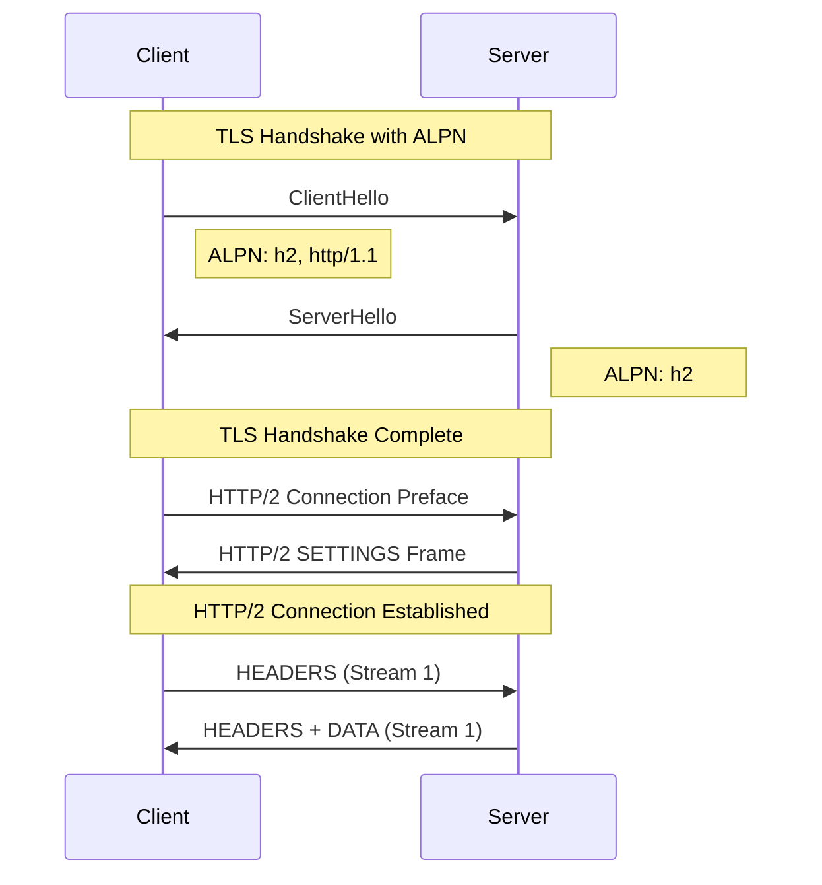
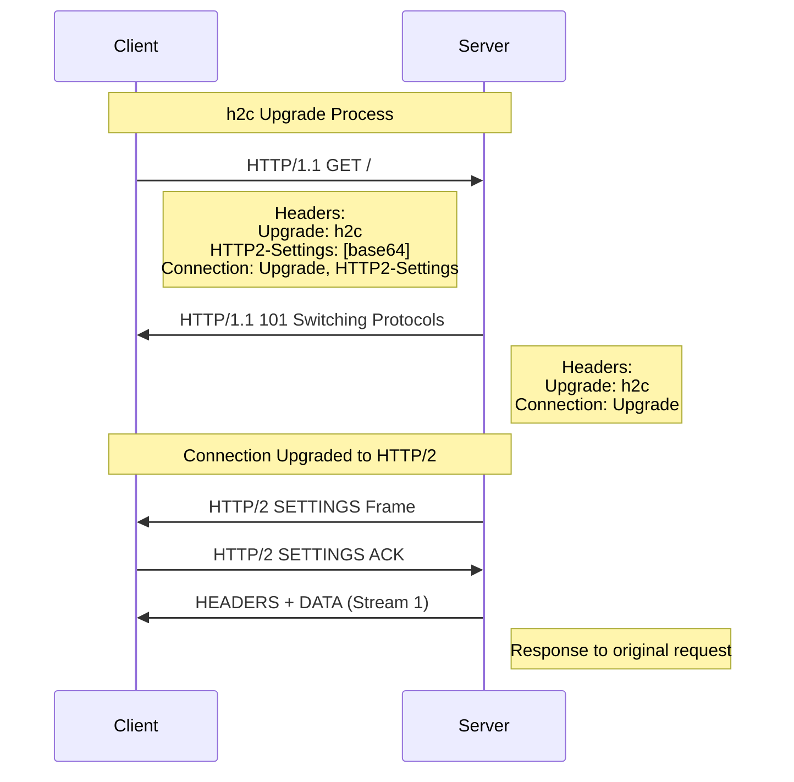
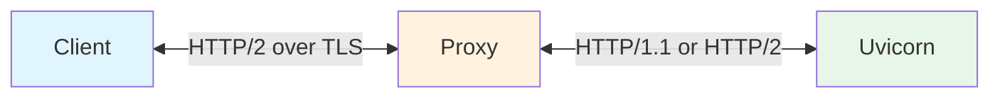

**Uvicorn** supports HTTP/2, the major revision of the HTTP protocol that provides significant
performance improvements over HTTP/1.1.

!!! warning "Experimental Feature"
    HTTP/2 support is currently **experimental** and is **not enabled by default**.

## Overview

HTTP/2 introduces several key features:

- **Multiplexing**: Multiple requests and responses can be sent simultaneously over a single TCP connection
- **Header compression**: HTTP headers are compressed using HPACK, reducing overhead
- **Binary protocol**: More efficient parsing compared to HTTP/1.1's text-based format
- **Stream prioritization**: Clients can indicate which resources are more important

## Enabling HTTP/2

To enable HTTP/2 support in Uvicorn, use the `--http2` flag:

=== "Command Line"
    ```bash
    uvicorn main:app --http2
    ```

=== "Programmatic"
    ```python
    import uvicorn

    uvicorn.run("main:app", http2=True)
    ```

!!! note
    HTTP/2 support requires the `h2` package. Install it with:
    ```bash
    pip install h2
    ```

## Connection Methods

HTTP/2 can be established through two different mechanisms: **h2** (over TLS) and **h2c** (cleartext).

### h2: HTTP/2 over TLS (Recommended)

When using HTTPS, HTTP/2 is negotiated via **ALPN** (Application-Layer Protocol Negotiation)
during the TLS handshake. This is the most common and recommended way to use HTTP/2.



For testing it locally, you can generate a self-signed certificate and use it to test the HTTP/2 connection.

```bash
openssl req -x509 -newkey rsa:2048 -keyout key.pem -out cert.pem -days 365 -nodes -subj "/CN=localhost"
```

Then create a simple ASGI application to test the connection.

```python title="main.py"
async def app(scope, receive, send):
    await send({"type": "http.response.start", "status": 200, "headers": []})
    await send({"type": "http.response.body", "body": b"ok"})
```

Run Uvicorn with the `--http2` flag and the SSL certificate files.

=== "Command Line"
    ```bash
    uvicorn app:app --http2 --ssl-keyfile key.pem --ssl-certfile cert.pem
    ```

=== "Programmatic"
    ```python
    import uvicorn

    uvicorn.run(
        "app:app",
        http2=True,
        ssl_keyfile="key.pem",
        ssl_certfile="cert.pem",
    )
    ```

You can test the connection using curl with the `--http2` flag.

```bash
# Use -k to skip certificate verification for self-signed certs
curl -v --http2 -k https://localhost:8000/
```

### h2c: HTTP/2 Cleartext

HTTP/2 can also be used without TLS through an **upgrade mechanism**. The client sends an
HTTP/1.1 request with upgrade headers, and if the server supports HTTP/2, it responds with
`101 Switching Protocols`.



Using the same `main.py` from the h2 section above, run Uvicorn with the `--http2` flag.

=== "Command Line"
    ```bash
    uvicorn main:app --http2
    ```

=== "Programmatic"
    ```python
    import uvicorn

    uvicorn.run("main:app", http2=True)
    ```

You can test the connection using curl with the `--http2` flag.

```bash
curl -v --http2 http://localhost:8000/
```

!!! warning
    h2c is not supported by web browsers. Browsers only support HTTP/2 over TLS (h2).
    h2c is primarily useful for internal services, proxies, or testing.

## ASGI Scope

When a request comes in over HTTP/2, the ASGI scope will have `http_version` set to `"2"`:

```python
async def app(scope, receive, send):
    assert scope["type"] == "http"
    print(f"HTTP Version: {scope['http_version']}")  # "2" for HTTP/2
    # ... handle request
```

## Using with Reverse Proxies

In production, Uvicorn is typically deployed behind a reverse proxy like Nginx, Caddy, or HAProxy.

**Benefits of using a reverse proxy:**

- **TLS termination**: The proxy handles SSL/TLS encryption, offloading this work from your application
- **Load balancing**: Distribute requests across multiple Uvicorn instances
- **Static file serving**: Serve static assets directly without hitting your Python application
- **Request buffering**: Buffer slow clients to free up Uvicorn workers
- **Security**: Hide your application server details, add rate limiting, and filter malicious requests
- **HTTP/2 to clients**: Provide HTTP/2 benefits to clients even if using HTTP/1.1 internally



### Proxy HTTP/2 Upstream Support

**HTTP/2 Upstream** refers to the protocol used between the proxy and the backend server (Uvicorn).
While all modern proxies support HTTP/2 for client connections, support for HTTP/2 to backend
servers varies.

**Multiplexing** is HTTP/2's ability to send multiple requests simultaneously over a single TCP
connection. Without multiplexing, each request requires its own connection, negating a key
benefit of HTTP/2. Some proxies support HTTP/2 upstream but open a new connection per request,
which means they don't truly multiplex.

Here's the current state of proxy support (as of 2026-02-02):

| Proxy | HTTP/2 Upstream | Multiplexing | Documentation |
|-------|-----------------|--------------|---------------|
| **Envoy** | Yes | Yes | [Connection Pooling Docs](https://www.envoyproxy.io/docs/envoy/latest/intro/arch_overview/upstream/connection_pooling) |
| **Caddy** | Yes | Yes | [reverse_proxy Docs](https://caddyserver.com/docs/caddyfile/directives/reverse_proxy) |
| **HAProxy** | Yes | Yes | [HTTP/2 Docs](https://www.haproxy.com/documentation/hapee/latest/load-balancing/protocols/http-2/) |
| **Traefik** | Yes | Yes | [ServersTransport Docs](https://doc.traefik.io/traefik/routing/services/) |
| **Apache** | Partial | No | [mod_proxy_http2 Docs](https://httpd.apache.org/docs/trunk/mod/mod_proxy_http2.html) |
| **Nginx** | Limited | No | [Trac Ticket #923](https://trac.nginx.org/nginx/ticket/923) |

### Recommended Proxy Configuration

For most production deployments, using **HTTP/1.1 with keepalive** connections between the proxy
and Uvicorn is recommended. This provides excellent performance while being simple to configure
and debug.

!!! note "h2c Prior Knowledge Not Supported"
    Uvicorn's h2c implementation uses the HTTP/1.1 upgrade mechanism. It does **not** support
    "prior knowledge" h2c where clients send the HTTP/2 connection preface directly. This means
    proxy configurations using `h2c://` URLs will not work.

    For HTTP/2 between proxy and Uvicorn, use **h2 over TLS** (ALPN negotiation).

## Performance Considerations

HTTP/2 provides the most benefit when:

- **High latency connections**: Multiplexing reduces round-trip overhead
- **Many concurrent requests**: Multiple streams share a single connection
- **Large headers**: HPACK compression reduces header overhead

For internal, low-latency connections (like proxy to backend), HTTP/1.1 with keepalive
often performs comparably to HTTP/2, which is why nginx's approach is still effective.
